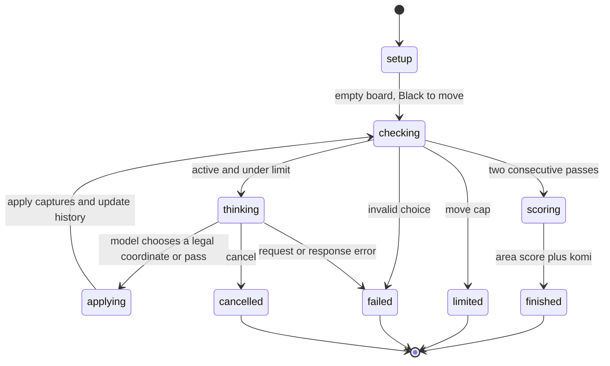

# Clef vs Jev: Go on a 9×9 board

This original example runs Go (Baduk/Weiqi) through a go-xstate machine.
Clef plays Black and Jev plays White. Each decision offers every legal
intersection plus `pass`: **82 choices on an empty 9×9 board**. The model
chooses a coordinate; the Go code enforces captures and repetition rules.

The board starts empty. Coordinates use columns `A B C D E F G H J` and
rows 1–9, with `A1` at the bottom left. `X` represents Black and `O` White.
Occupied points and placements repeating an earlier board are excluded.
The choices are not ranked or filtered by a playing engine.

## Run

From `examples/`, with Go 1.26 or later, try the deterministic local demo:

```sh
go run ./badukmatch/cmd/baduk -demo -sgf /tmp/baduk-demo.sgf
```

It makes twelve placements and then passes twice. It needs no credentials
and does not call either model. [sample-demo.sgf](sample-demo.sgf) records
this demo; its player names explicitly identify the scripted choosers.

To use the OpenRouter Decisions API with Clef and Jev:

```sh
read -r -s OPENROUTER_KEY
export OPENROUTER_KEY
go run ./badukmatch/cmd/baduk -sgf /tmp/clef-vs-jev.sgf
unset OPENROUTER_KEY
```

Paste the key into the hidden prompt and press Enter. The client also accepts
`OPENROUTER_API_KEY`. Credentials stay in the client, outside match snapshots
and SGF records. The output path must not already exist; the CLI reserves it
before any model requests and retains played moves if a request fails or the
user presses Ctrl+C.

| Flag | Default | Meaning |
| --- | --- | --- |
| `-size` | `9` | Board width and height; supports 2–19 |
| `-black` | `cloudflare/clef` | Black's decision model, moving first |
| `-white` | `typesafe/jev-1.13` | White's decision model |
| `-komi` | `7.5` | Points added to White's area score, in half-point increments |
| `-max-moves` | `1000` | Move cap, including passes |
| `-request-timeout` | `45s` | Deadline per model request |
| `-timeout` | `30m` | Deadline for the match |
| `-sgf` | None | Save the game as SGF |
| `-demo` | `false` | Use local scripted choices |

For programmatic use, pass a `ChooseMove` function to `Play`. `Config{}`
uses a 9×9 board and a 1,000-move cap; unlike the CLI, its `Komi` field is
used as supplied, including zero.

## Rules and scoring

The example implements the core [Tromp–Taylor rules](https://tromp.github.io/go.html)
with configurable board size and komi:

- Black starts; players alternate placements or passes.
- After placement, remove opponent groups without liberties, then own groups
  without liberties. A liberty is an orthogonally adjacent empty point.
- Positional superko forbids any placement whose resulting board appeared
  earlier, regardless of who was next to play. Passing is exempt.
- Self-capture is allowed when it produces a new board. A single-stone
  suicide that leaves the board unchanged is therefore illegal.
- Two consecutive passes end the game. Score stones plus empty regions
  touching only that player's stones, then add komi to White.

Dead stones are **not automatically removed at scoring**. Players must capture
them before passing. The prompt states this explicitly. There is no negotiated
dead-group removal or automatic life-and-death judgement. Premature passes can
therefore give away points. These are play-out rules, rather than Japanese
territory scoring.

A cap, cancellation, or provider error leaves the result `*` and the SGF without
a result property. It is not counted as a draw. The second pass takes precedence
over the cap when both happen on the same move. Completed games use `B+margin`,
`W+margin`, or `0` for a tie. SGF follows the
[FF[4] format](https://www.red-bean.com/sgf/properties.html), with empty move values
for passes.

## State machine



`thinking` invokes a promise actor whose cancellation reaches the HTTP request.
Rules and scoring are pure local functions. Board strings and repetition
history remain unchanged in older snapshots when a new move is applied.

The [Decisions API](https://openrouter.ai/docs/api/api-reference/alphadecisions/submit-a-decisions-request)
request contains the board, side to move, komi, rules, move number, pass count,
and eight recent moves. A `choice` question maps every legal coordinate and
`pass` to a description. Malformed responses and choices outside that list stop
the match; the client does not retry or substitute a move.

## Live API check

On 7 October 2026, a two-move run from the empty 9×9 board completed:

| Model | Legal choices offered | Selected move | Reported cost |
| --- | ---: | --- | ---: |
| Clef, Black | 82 | E5 | $0.000554 |
| Jev, White | 81 | D5 | $0.000092 |

Total accepted-response cost was approximately **$0.000646**. The saved
[opening SGF](sample-live-opening.sgf) has no result because this check stopped
at two moves. It verifies the API path and choice-list size, not playing
strength or a completed game. Larger boards produce more choices; their live
API behavior has not been checked in this example.

## Verification

```sh
go test -race ./badukmatch/... -count=1
```

Tests exercise multi-group captures, self-capture, ko and older repetitions,
pass handling, neutral regions, komi, snapshot isolation, cancellation, SGF,
and HTTP response validation. HTTP tests use local servers and a dummy key.

The rules tests also replay **380 moves** generated independently with
[sgfmill 1.1.1](https://mjw.woodcraft.me.uk/sgfmill/doc/1.1.1/boards.html), comparing
every legal-choice list, resulting board, and area-score difference. These
fixtures include 252 captured opponent stones and 65 self-captured stones.
Sgfmill supplies captures and area scoring; the generator separately filters
repeated boards because that library does not enforce superko.

Regenerate those fixtures from this directory:

```sh
uv run --with sgfmill==1.1.1 python testdata/generate.py
```

The committed fixtures keep CI offline. This example has no upstream XState
counterpart and is separate from the 49 ports in `examples/manifest.tsv`.
