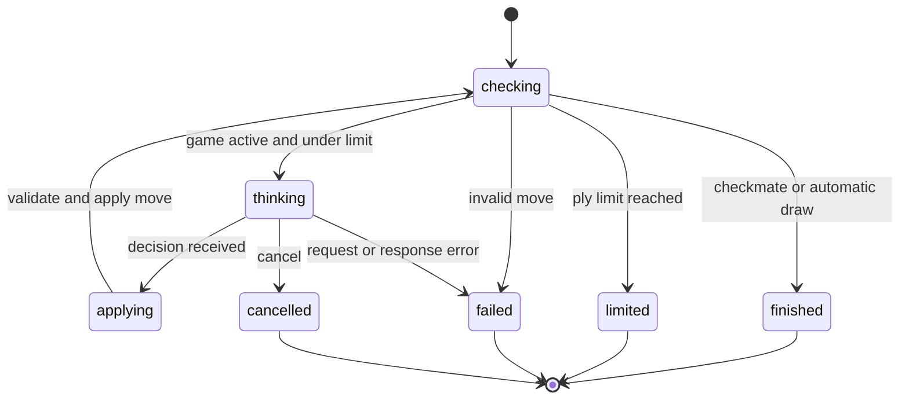

# Clef vs Jev: chess in a state machine

An original Go example: `cloudflare/clef` plays White and `typesafe/jev-1.13`
plays Black. A go-xstate machine owns the turn sequence, applies legal moves,
detects game completion, and cancels outstanding requests when the match stops.

Both models use OpenRouter's
[Decisions API](https://openrouter.ai/docs/api/api-reference/alphadecisions/submit-a-decisions-request).
Each turn sends the FEN, board, side to move, and the last eight moves. A
`choice` question lists every legal UCI move with its algebraic notation.
The model chooses a move; the
[chess library](https://github.com/CorentinGS/chess/tree/v2.6.0) enforces the rules.

## Run

From the repository's `examples/` directory, with Go 1.26 or later:

```sh
read -r -s OPENROUTER_KEY
export OPENROUTER_KEY
go run ./chessmatch/cmd/chess -max-plies 80 -pgn /tmp/clef-vs-jev.pgn
unset OPENROUTER_KEY
```

The `read` command accepts the key without echoing it; paste it and press Enter.
`OPENROUTER_API_KEY` is also accepted when `OPENROUTER_KEY` is unset. Keys stay
in the client process and are not included in snapshots, PGN, or request logs.
The PGN path must not already exist; it is reserved before model requests begin.

| Flag | Default | Purpose |
| --- | --- | --- |
| `-white` | `cloudflare/clef` | White's decision model |
| `-black` | `typesafe/jev-1.13` | Black's decision model |
| `-max-plies` | `80` | Maximum half-moves, one move by either side per ply |
| `-request-timeout` | `45s` | Deadline for each HTTP request |
| `-timeout` | `10m` | Deadline for the whole match |
| `-fen` | Standard starting position | Start from a supplied FEN |
| `-pgn` | No file | Save the final or interrupted game |

Swap the players with:

```sh
go run ./chessmatch/cmd/chess \
  -white typesafe/jev-1.13 -black cloudflare/clef -max-plies 40
```

The CLI prints the player, SAN and UCI move, model confidence, request latency,
and reported cost after each turn. It prints the board, FEN, result, and PGN at the
end. Ctrl+C cancels the active request and preserves the moves already played.

## State machine



`thinking` invokes a promise actor. Its context cancellation reaches the HTTP
request when the state exits. `applying` checks the selected move against the
current legal moves before updating the snapshot. Move history is replayed
into a fresh chess game on each turn, preserving repetition detection while
keeping mutable chess objects out of shared snapshots.

Checkmate, stalemate, insufficient material, fivefold repetition, and the
75-move rule are handled by the chess library. The models do not offer or claim
draws. A ply limit or interrupted match keeps the PGN result `*`; it is not
reported as a draw. HTTP errors, timeouts, malformed answers, and illegal
choices stop the match without retrying or substituting a move.

## Live run

On 6 October 2026, a run from the initial position ended with Clef winning
after 15 plies:

```text
1. d4 d5 2. e4 dxe4 3. Nf3 exf3 4. Qxf3 Qxd4
5. Nc3 Qxc3+ 6. Qxc3 Bh3 7. Qxh3 Nf6 8. Qc8# 1-0
```

The reported cost for these 15 decisions was approximately **$0.002808**.
The [saved PGN](sample-game.pgn) records the game. This is one observed run,
not a strength benchmark; subsequent requests can produce different games.
Decision confidence is the model's choice confidence, not a probability of
winning the chess game. Reported total cost covers accepted move responses,
not account-wide spending or failed requests.

The [Clef model card](https://openrouter.ai/cloudflare/clef) notes truncation of
long text state. This example keeps state to the current board and recent
moves. The endpoint is alpha; provider availability and API behavior can change.

## Offline tests

```sh
go test -race -count=1 ./chessmatch/...
```

Tests use scripted move choosers and local HTTP servers. They cover alternating
models, checkmate, special moves, draws, move limits, snapshot isolation,
cancellation, and invalid provider responses. No API key or paid request is
needed in CI. The existing examples CI job discovers this package automatically.

Files:

- `machine.go`: match states, chess rules, and the `Play` runner.
- `openrouter.go`: authenticated Decisions API calls and response validation.
- `cmd/chess/main.go`: environment configuration, output, and PGN saving.

This example has no upstream JavaScript counterpart and is separate from the
49 ports listed in `examples/manifest.tsv`.
